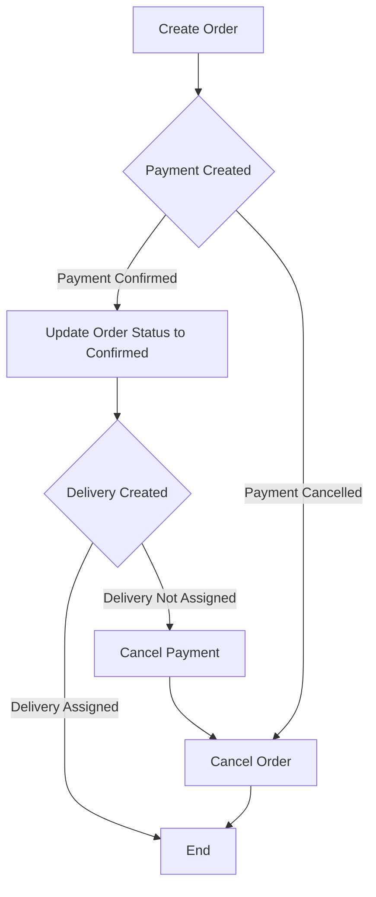
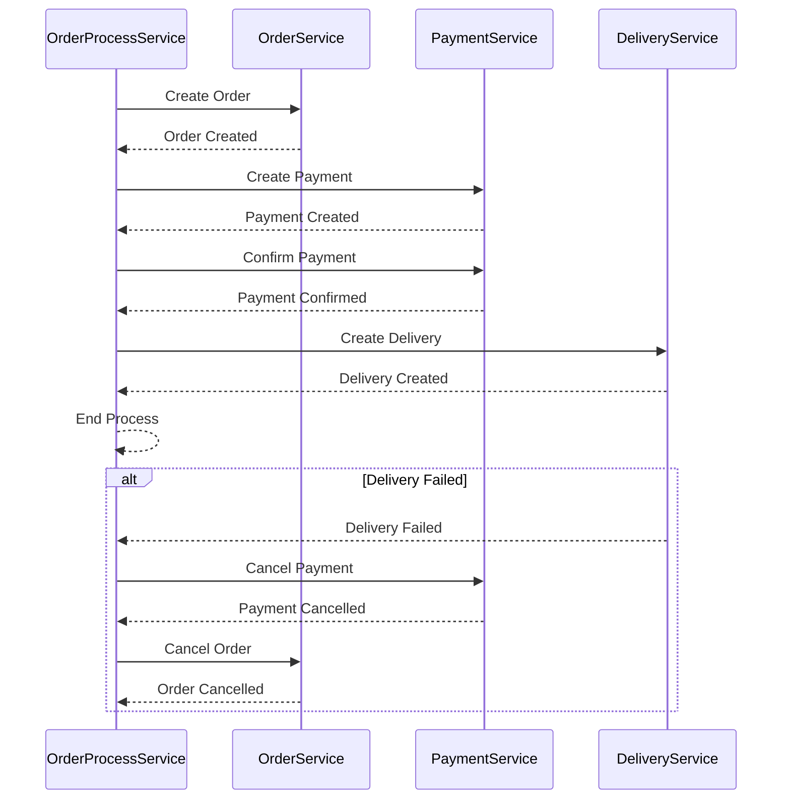

# fastapi-saga-pattern-example

**Note:** The orchestrator method will also be added soon...
**Note:** Please note that the emphasis of this project is not on the overall architecture, code quality, or best practices. The code provided serves as a simplified example to illustrate the application of the Saga Choreography pattern and may not follow all the principles of clean code or optimal architectural design.

The Saga design pattern is used for managing distributed transactions. In this pattern, a large transaction is broken down into smaller, independent operations. Each operation can be executed separately, and for every main operation, there’s a compensating action that undoes changes if something goes wrong.

To implement Saga, we have two models: choreography and orchestration.
## Choreography Model
In this model, each service starts and manages its operations in sequence. After a service completes its task, it notifies the next service to begin. If an issue arises in any of the services, compensating actions are triggered in reverse order to undo the previous steps.

### Advantages:
Simplicity in implementation, as services automatically interact with each other without needing a central coordinator.
No single point of failure (SPOF), since the operations are distributed among the services.

### Disadvantages:
There’s a higher risk of cyclic dependencies, as services depend on each other’s instructions.

## Orchestration Model
Unlike choreography, this model has a central coordinator that manages all the steps and services. This Saga Orchestrator controls both the main operations and the compensating actions.

### Advantages:
It’s well-suited for managing complex processes, especially when there are many services involved.
The chance of cyclic dependencies is very low because the orchestrator handles everything.

### Disadvantages:
Implementing the orchestration logic can be complex.
It introduces a single point of failure (SPOF), as the orchestrator manages all processes.
In conclusion, choosing between these models depends on the specific needs of the project. It’s important to consider the complexity of the system, the number of services, and the need for compensating actions when selecting the right approach.

# Choreography Pattern
This project implements an Order Management System using the Saga Choreography Pattern to manage distributed transactions across three services: OrderService, PaymentService, and DeliveryService. The system uses an event-driven architecture to ensure that each service can independently handle its part of the transaction while staying synchronized through events.

### System Overview
The system consists of the following services: 
<strong>OrderService:</strong> Manages customer orders. 
<strong>PaymentService:</strong> Handles payment transactions. 
<strong>DeliveryService:</strong> Manages deliveries for confirmed orders. 

The Saga Choreography Pattern is used to coordinate the process across these services. Each service listens for and reacts to specific events, ensuring consistency across the system without a central coordinator.

### Workflow
#### 1. Create an Order:
- A new order is created via the /orders/create_order endpoint. 
- After successfully creating the order, an event create-payment is emitted. 

#### 2. Create a Payment
- The PaymentService receives the create-payment event and creates a payment with the status pending. 
- The user can then confirm or cancel the payment using the following endpoints:
  - payments/confirm to confirm the payment.
  - payments/cancel to cancel the payment.

#### 3. Payment Confirmation or Cancellation
- **Cancellation:** 
If the user cancels the payment, the system emits a cancel-order event: 
  - OrderService receives the cancel-order event and marks the order as cancelled, ending the process.
- **Confirmation:** 
If the user confirms the payment:
  - PaymentService emits an order-confirmed event.
  - OrderService updates the order status to confirmed and emits a create-delivery event.

#### 4. Delivery Creation

- **Success:** 
  DeliveryService creates a delivery for the order. If the delivery is successfully assigned to a dealer, the process ends.

- **Failure:** 
If the delivery cannot be assigned, DeliveryService emits a cancel-payment event:
  - PaymentService cancels the payment and emits a cancel-order event.
  - OrderService marks the order as cancelled.

# Orchestration Pattern
This project implements an Order Management System using the Saga Orchestration Pattern to manage distributed transactions across three services: OrderService, PaymentService, and DeliveryService. In this approach, a central service called OrderProcessService coordinates and executes the various steps involved in the process.

## System Overview
The system consists of the following services:

OrderService: Manages customer orders, including creation, confirmation, and cancellation.
PaymentService: Handles payment transactions for orders.
DeliveryService: Manages deliveries for confirmed orders.
In this architecture, OrderProcessService acts as the orchestrator, controlling the sequence of operations and ensuring each step is completed in the correct order. It directly communicates with each service to coordinate the transaction flow.

## Workflow
### 1. Create an Order:
The order process starts by calling the start_order_process method in OrderProcessService.
OrderService creates an order and returns its ID to OrderProcessService.
### 2. Process Payment:
After the order is created, OrderProcessService triggers the payment creation by calling the process_payment method.
If the payment is successfully created, OrderProcessService proceeds to confirm the payment.
Upon successful confirmation, the process moves to the next stage (delivery).
If payment creation or confirmation fails, the system initiates an order cancellation.
### 3. Process Delivery:
OrderProcessService requests delivery creation by calling the process_delivery method.
If the delivery is successfully assigned, the process completes successfully.
If the delivery assignment fails, the system cancels both the payment and the order.
4. Cancel Process (if any step fails):
If any step fails (payment or delivery), OrderProcessService sequentially calls cancel_payment and then cancel_order to complete the rollback process.

### Code Overview
OrderProcessService is responsible for orchestrating the entire process: 
<strong>start_order_process:</strong> Manages the full order process by creating an order, then processing payment and delivery. 
<strong>process_payment:</strong> Sends a request to create a payment and, upon success, confirms it. 
<strong>confirm_payment:</strong> Confirms the created payment. 
<strong>cancel_payment:</strong> Cancels the payment if a subsequent step fails. 
<strong>process_delivery:</strong> Sends a request to create a delivery and completes the process upon success.

