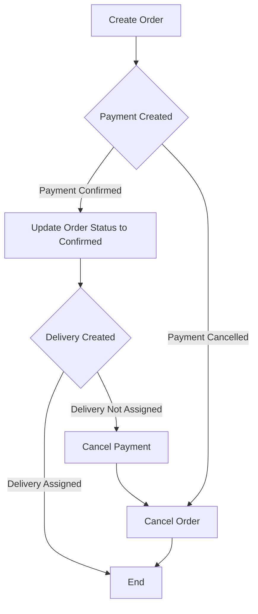

# Choreography Pattern
This project implements an Order Management System using the Saga Choreography Pattern to manage distributed transactions across three services: OrderService, PaymentService, and DeliveryService. The system uses an event-driven architecture to ensure that each service can independently handle its part of the transaction while staying synchronized through events.

### System Overview
The system consists of the following services: 
<strong>OrderService:</strong> Manages customer orders. 
<strong>PaymentService:</strong> Handles payment transactions. 
<strong>DeliveryService:</strong> Manages deliveries for confirmed orders. 

The Saga Choreography Pattern is used to coordinate the process across these services. Each service listens for and reacts to specific events, ensuring consistency across the system without a central coordinator.

### Workflow
#### 1. Create an Order:
- A new order is created via the /orders/create_order endpoint. 
- After successfully creating the order, an event create-payment is emitted. 

#### 2. Create a Payment
- The PaymentService receives the create-payment event and creates a payment with the status pending. 
- The user can then confirm or cancel the payment using the following endpoints:
  - payments/confirm to confirm the payment.
  - payments/cancel to cancel the payment.

#### 3. Payment Confirmation or Cancellation
- **Cancellation:** 
If the user cancels the payment, the system emits a cancel-order event: 
  - OrderService receives the cancel-order event and marks the order as cancelled, ending the process.
- **Confirmation:** 
If the user confirms the payment:
  - PaymentService emits an order-confirmed event.
  - OrderService updates the order status to confirmed and emits a create-delivery event.

#### 4. Delivery Creation

- **Success:** 
  DeliveryService creates a delivery for the order. If the delivery is successfully assigned to a dealer, the process ends.

- **Failure:** 
If the delivery cannot be assigned, DeliveryService emits a cancel-payment event:
  - PaymentService cancels the payment and emits a cancel-order event.
  - OrderService marks the order as cancelled.

