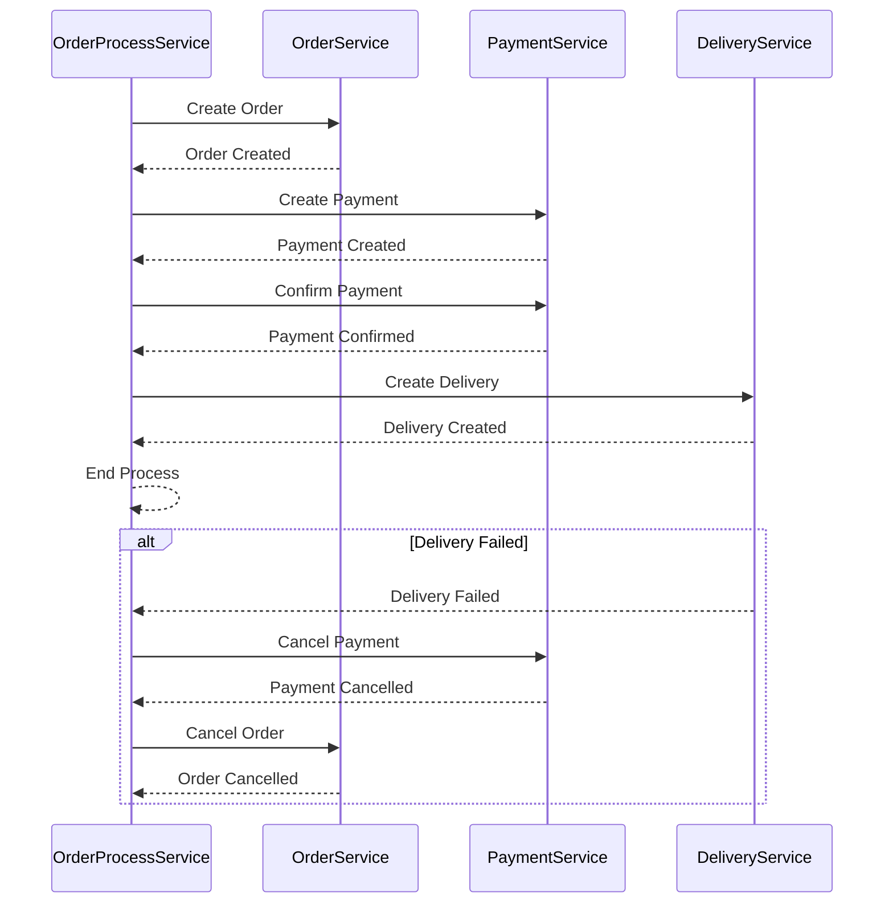

# Orchestration Pattern
This project implements an Order Management System using the Saga Orchestration Pattern to manage distributed transactions across three services: OrderService, PaymentService, and DeliveryService. In this approach, a central service called OrderProcessService coordinates and executes the various steps involved in the process.

## System Overview
The system consists of the following services:

OrderService: Manages customer orders, including creation, confirmation, and cancellation.
PaymentService: Handles payment transactions for orders.
DeliveryService: Manages deliveries for confirmed orders.
In this architecture, OrderProcessService acts as the orchestrator, controlling the sequence of operations and ensuring each step is completed in the correct order. It directly communicates with each service to coordinate the transaction flow.

## Workflow
### 1. Create an Order:
The order process starts by calling the start_order_process method in OrderProcessService.
OrderService creates an order and returns its ID to OrderProcessService.
### 2. Process Payment:
After the order is created, OrderProcessService triggers the payment creation by calling the process_payment method.
If the payment is successfully created, OrderProcessService proceeds to confirm the payment.
Upon successful confirmation, the process moves to the next stage (delivery).
If payment creation or confirmation fails, the system initiates an order cancellation.
### 3. Process Delivery:
OrderProcessService requests delivery creation by calling the process_delivery method.
If the delivery is successfully assigned, the process completes successfully.
If the delivery assignment fails, the system cancels both the payment and the order.
4. Cancel Process (if any step fails):
If any step fails (payment or delivery), OrderProcessService sequentially calls cancel_payment and then cancel_order to complete the rollback process.

### Code Overview
OrderProcessService is responsible for orchestrating the entire process: 
<strong>start_order_process:</strong> Manages the full order process by creating an order, then processing payment and delivery. 
<strong>process_payment:</strong> Sends a request to create a payment and, upon success, confirms it. 
<strong>confirm_payment:</strong> Confirms the created payment. 
<strong>cancel_payment:</strong> Cancels the payment if a subsequent step fails. 
<strong>process_delivery:</strong> Sends a request to create a delivery and completes the process upon success.

